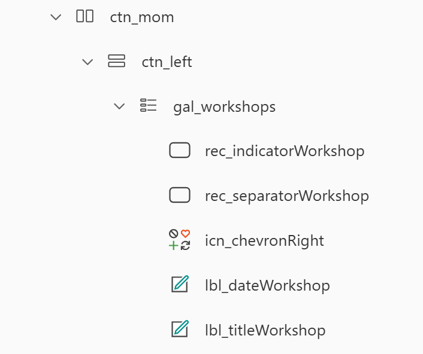
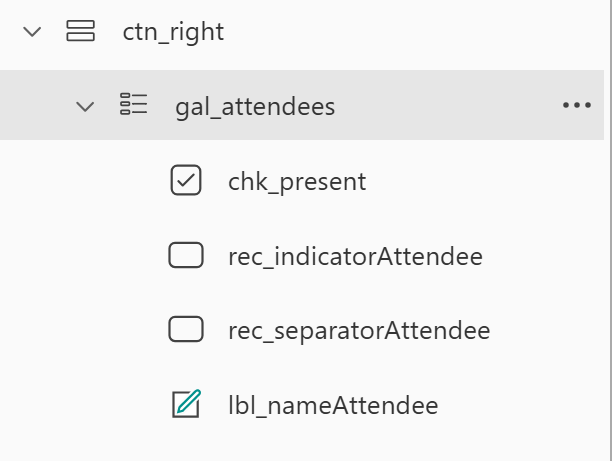

# Add and edit List items through Power Apps with a Form

💡 We will use modern controls in this tutorial. If they are ot enabled yet, please do so by selecting **Settings** > **Updates** and then toggle the switch of **modern controls and themes** to `yes`.

We wil work with our data locally using collections. In the **App** object, select **OnStart** an put in the following code:

`ClearCollect(colWorkshops, Workshops); ClearCollect(colRegistrations, Registrations)`

This will save the content of your SharePoint Lists in two local collections. To execute this, right-select **App** > **Run Onstart**

## Create Screens

We will first create a screen to add new Workshops, and another one to manage the attendance of workshops.

1. As your shiny new app already has one screen, rename it to `Create Workshop Screen`.
2. Add another Screen, name it `Manage Attendance Screen`

## Create Workshop Screen

1. Insert a text label, rename it to `lbl_header_createWorkshop`, here are the properties:
   * **Text**: `Create a Workshop`
   * **Height**: `60`
   * **X** and **Y**: `0`
   * **Width**: `Parent.Width`
   * **Size**: `30`
   * **Align**: `Center`
2. Insert a Form, rename it to `frm_CreateWorkshop`
   * Connect it to the **Workshops** List
   * Adjust the order of the fields

   * You can adjust the **Height** of the entire **Description_DataCard** and the **Height** of the **Description_DataCardValue** to make space for a longer text.
   * ❗Important: Set the **Default Mode** to `New`
3. Insert a button, rename it `btn_saveWorkshop`, here are the properties:
   * **Text**: `Save Workshop`
   * **OnSelect**: `SubmitForm(frm_CreateWorkshop); ResetForm(frm_CreateWorkshop); Navigate('Manage Attendance Screen',ScreenTransition.Fade)`

### Explanation SubmitForm and ResetForm

The SubmitForm function submits all values of a form to the right columns of the selected data source automagically ✨ We only need to pass in the name of our form.

The ResetForm function will empty the fields again for the next submission

### Explanation Navigate

The Navigate function can navigate to another screen, we pass in the screen name and optionally choose a transition. You need to create the screen you want to navigate to upfront :-)

## Create Manage Attendance Screen

1. Select **Templates** > **Split Screen**
2. Rename the containers to be `ctn_mom`, `ctn_left` and `ctn_right`
3. In `ctn_left`, add a vertical gallery, connect to your `col_workshops` by setting the **Items** to `col_Workshops`
   * choose **Layout**: `Title and Subtitle`
   * rename controls (no for real, make this a habit!)

   * set **Text** of  **lbl_titleWorkshop** to `ThisItem.Title`
   * set **Text** of  **lbl_dateWorkshop** to `ThisItem.Date`
4. In the `ctn_right`, add another vertical gallery, set the **Items** to `col_Workshops`
   * choose **Layout**: `Title and Subtitle`
   * set the **Items** to `Filter(colRegistrations, 'Workshop Title'.Id = gal_workshops.Selected.ID)`
   * rename controls (we mean it ✨)

### Explanation Filter

We only want to show items (people) in the **gal_registrations** (which is connected to our **colRegistrations**) who are registered for the selected workshop in the **gal_workshops**. Therefore we need to check if the `'Workshop Title'.Id` is the same as the `gal_workshops.Selected.ID`: `Filter(colRegistrations, 'Workshop Title'.Id = gal_workshops.Selected.ID)`

//TODO Luise

- workshops anlegen ✅
  - form✅ 
  - navigate ✅
- ws screen:
  - liste mit Workshops, in gallery Teilnehmer ✅
  - teilnehmer abhaken fuer anwesenheit (patch) ✅

- anwesenheitsspalte bool ✅

- PowerPoint:

  - intro
  - intro to PP
  - Prozess uebersicht

- MDA

  - Datenquellen
  - warum DV superior to SP
  - 30 minuten live
  - canvas vs mda: when to use what
  - 

rrosengrn@microsoft.com